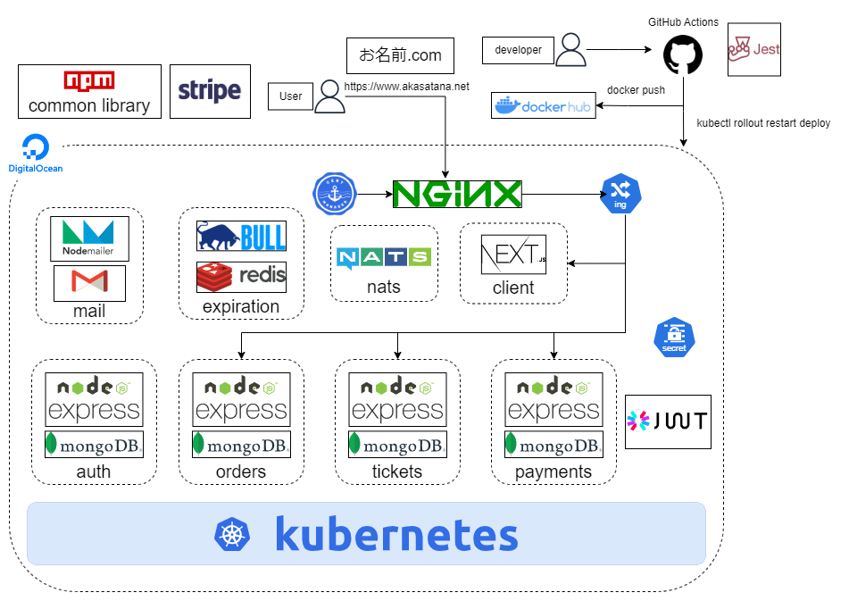
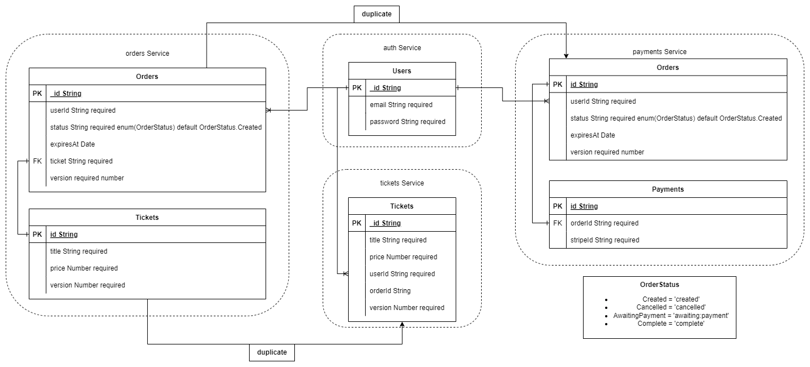
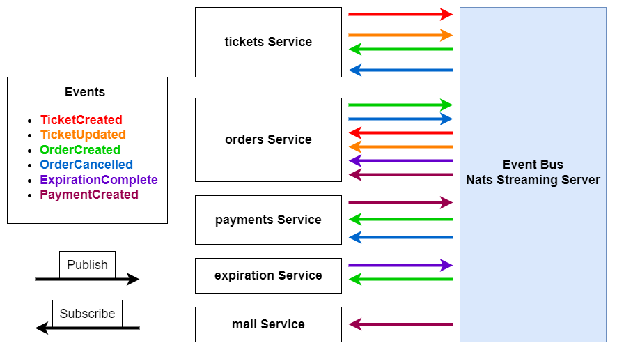

# Microservices in MERN: Ticket App

チケットの売り買いを行うアプリ

このプロジェクトは以下の Udemy 講座を参考に作成しました

[Microservices with Node JS and React](https://www.udemy.com/course/microservices-with-node-js-and-react/) by Stephen Grider

## URL

[Ticket App](https://www.akasatana.net)

## 機能一覧

アプリケーションが提供する具体的な機能を列挙します。

- auth Service
  - ユーザー登録と認証
- tickets Service
  - チケットの一覧表示
  - チケットの販売、編集
- orders Service
  - チケットの注文、削除、および一覧表示
- expiration Service
  - チケットの注文に対する有効期限管理
- payments Service
  - チケットのクレジットカードによる購入(Stripe テストモード)
- mail Service
  - チケット購入後のメール通知

## アーキテクチャ概要

全ての Service は独立してスケール可能です

### アーキテクチャ図

DigitalOcean の K8s クラスターにデプロイ



### ER 図



### Event フロー



## 使用技術

### 言語

- Node.js
- TypeScript

### フレームワーク

- Next.js
- React
- Express
- Bootstrap

### データベース

- MongoDB
- Redis

### コンテナ

- docker
- docker-compose

### オーケストレーション

- K8s

### CI/CD

- GitHub
- GitHub Actions
- Jest

### ホスト先

- Digital Ocean

### その他

- Stripe
- Gmail
- Mailtrap
- Nats Streaming Server
- Ingress Nginx
- JWT

## セットアップ手順

以下は、このプロジェクトをローカル環境で動かすための手順です

```bash
git clone https://github.com/akasatana137/micro-sample-ticket.git
```

### 事前準備

- [DockerDesktop](https://www.docker.com/ja-jp/products/docker-desktop/)をインストール
- DockerDesktop で K8s を有効化
- [Helm](https://helm.sh/ja/)をインストール
- [IngressNginx](https://kubernetes.github.io/ingress-nginx/deploy/#docker-desktop)をインストール
- [Skaffold]()をインストール
- [Stripe](https://stripe.com/jp)アカウントを作成(PublicKey, PrivateKey を使用)
- /etc/hosts ファイルにを変更して名前解決を適用

```bash
alias k="kubectl"
# Podに必要な環境変数を作成(xxxxxのみを変更)
k create secret generic jwt-secret --from-literal=JWT_KEY=xxxxxxxxxxxxxxxx
k create secret generic stripe-public --from-literal=NEXT_PUBLIC_STRIPE_PUB=xxxxxxxxxxxxxxxx
k create secret generic stripe-secret --from-literal=STRIPE_KEY=xxxxxxxxxxxxxxxx

# IngressNginxを作成
helm upgrade --install ingress-nginx ingress-nginx \
  --repo https://kubernetes.github.io/ingress-nginx \
  --namespace ingress-nginx --create-namespace

# K8sリソースを作成
skaffold dev
# skaffoldが使えない場合
# 各サービスのDockerイメージを作成
docker build -t ${Image name} ${docker context}
k apply -f infra/k8s
k apply -f k8s-dev

# 名前解決
vim /etc/hosts
127.0.0.1 ticketing.dev

curl ticketing.dev
```

## CI/CD

- 該当サービスへの pull requests が発生すると Jest テストが実行
- master ブランチへの Push を契機に dockerHub に最新 Image を Push し K8s Deployment を最新のものに変更

## デプロイ方法

### DigitalOcean

#### 事前準備

- [doctl](https://github.com/digitalocean/doctl?tab=readme-ov-file#installing-doctl)をインストール
- DigitalOcean の API トークンを作成

```bash
# 認証
doctl auth init
```

1. コンソールから DigitalOcean で K8s クラスターを作成

DigitalOcean 上への接続設定ファイルを作成

```bash
doctl kubernetes cluster kubeconfig save ${cluster name}
# 作成したものが存在することを確認
kubectl config view
# contextをswitch
kubectl config use-context ${context name}
# digital ocean上のNodeを取得できることを確認
kubectl get node
```

> [!WARNING]
> 作成する Node は最低 3 つ以上。Spec が低すぎるとデプロイ途中で Node が"Not Ready"になるので注意

2. local 環境の時と同様に K8s Secret を作成

3. Ingress Nginx を作成

https://www.digitalocean.com/community/tutorials/how-to-set-up-an-nginx-ingress-on-digitalocean-kubernetes-using-helm#step-3-exposing-the-app-using-an-ingress

```bash
helm repo add ingress-nginx https://kubernetes.github.io/ingress-nginx
helm repo update
helm install nginx-ingress ingress-nginx/ingress-nginx --set controller.publishService.enabled=true
```

4. K8s リソースをデプロイ

infra/ 以下に何かしらのコードを変更して master ブランチに push

5. ドメインを取得して適用

お名前.com でドメインを購入後、ネームサーバを設定

Ingress Nginx によって作成された LB に A レコード、C レコードを追加

6. HTTPS 通信

https://www.digitalocean.com/community/tutorials/how-to-set-up-an-nginx-ingress-on-digitalocean-kubernetes-using-helm#step-4-securing-the-ingress-using-cert-manager

```bash
kubectl create namespace cert-manager

helm repo add jetstack https://charts.jetstack.io
helm repo update
helm install cert-manager jetstack/cert-manager --namespace cert-manager --version v1.10.1 --set installCRDs=true
```

Cert-Manager を作成し、Ingress を修正

```bash
kubectl apply -f infra/digital-ocean
```

### AWS

準備中

## 今後の改善点

- デプロイ先を AWS EKS に変更
- K8s Secret の適切な管理。デフォルトでは etcd に平文として保管されるので暗号化したい
- mail Service によるユーザー登録時のメール認証機能
- mail Service によるパスワード再設定機能
- チケットの画像を登録できるよう Cloudinary を利用
- チケットの作成者がチケットを買えなくする
- PV、PVC を使って MongoDB のデータを永続化
- metrics Server を導入して HPA
- Istio でマイクロサービス間の TLS 通信
